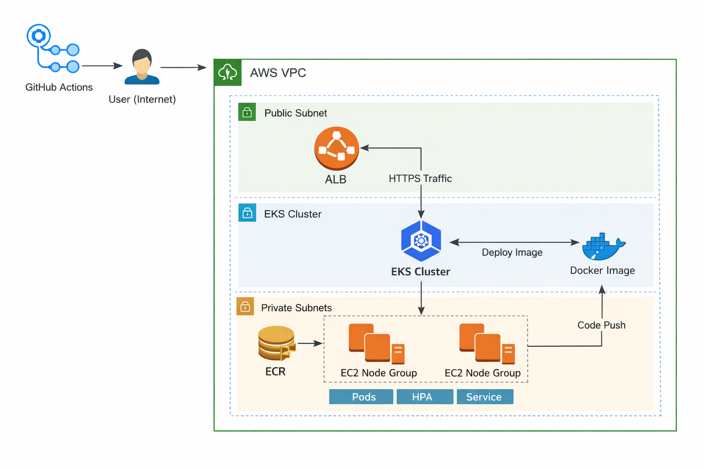

# EKS Mini Platform (V1)

Production-style mini platform on AWS:
- Terraform: VPC + EKS + ECR
- App: FastAPI (health + readiness + metrics)
- K8s: Deployment, Service, Ingress (ALB), HPA, resource limits
- CI/CD: GitHub Actions (build → push to ECR → deploy)

## Local run
```bash
docker build -t api:local ./app
docker run --rm -p 8000:8000 api:local
curl localhost:8000/healthz
```

