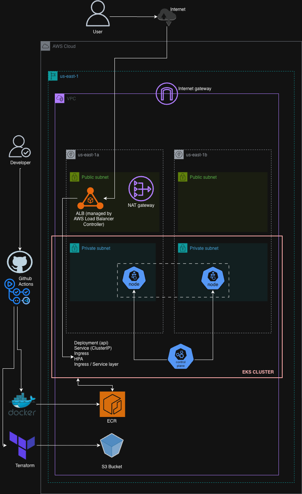
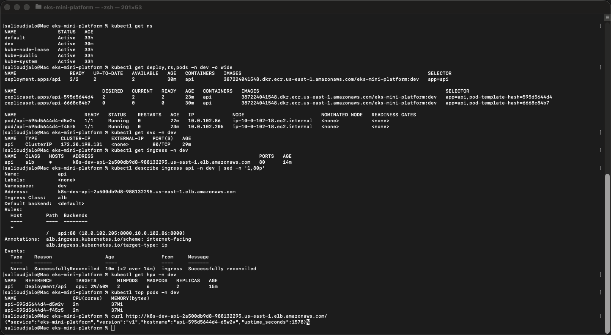
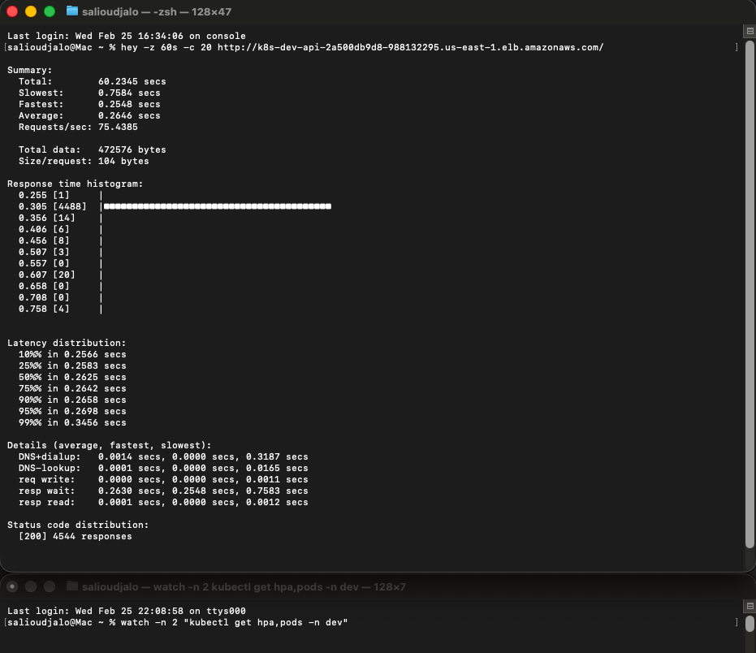

# EKS Mini Platform (V1)

A lightweight, production-minded AWS EKS project demonstrating how to provision infrastructure with Terraform and deploy a containerized FastAPI service using Kubernetes best practices.

---

## 🚀 What This Project Demonstrates

- **Terraform**: VPC (public/private subnets), NAT Gateway, EKS cluster, ECR repository
- **Docker**: Production-friendly container image
- **Kubernetes**:
  - Namespace separation
  - Deployment & Service
  - ALB Ingress (AWS Load Balancer Controller)
  - Horizontal Pod Autoscaler (HPA)
  - Liveness & Readiness probes
  - Resource requests & limits
- **CI/CD**: GitHub Actions → build → push to ECR → deploy to EKS

---

## 🏗 Architecture



---

## 📸 Proof of Deployment

### Kubernetes Resources


### Load Testing (HPA scaling validation)


---

## 🧪 Local Development

```bash
docker build -t api:local ./app
docker run --rm -p 8000:8000 api:local
curl localhost:8000/healthz
```

## ☁️ Infrastructure Provisioning

```bash
cd terraform
terraform init
terraform apply
```

This provisions:

- VPC (2 AZ)
- Public + Private subnets
- NAT Gateway
- EKS cluster
- Managed node group
- ECR repository

## 🚀 Application Deployment

Once EKS is ready:
```bash
kubectl apply -f k8s/
```
Ingress will automatically provision an AWS Application Load Balancer.

## 🔁 CI/CD Workflow

On every push to main:

1. Docker image is built
2. Image is pushed to Amazon ECR
3. Kubernetes deployment image is updated
4. Rollout is verified

## 💰 Cleanup (Important)

EKS + NAT gateway incur costs; destroy resources when finished.

To avoid AWS charges:
```bash
cd terraform
terraform destroy
```

## 📌 Notes

- Designed as a minimal but production-oriented platform.
- Focused on infrastructure automation, container lifecycle, and Kubernetes reliability patterns.
- Observability stack intentionally excluded in V1 to keep scope lightweight.